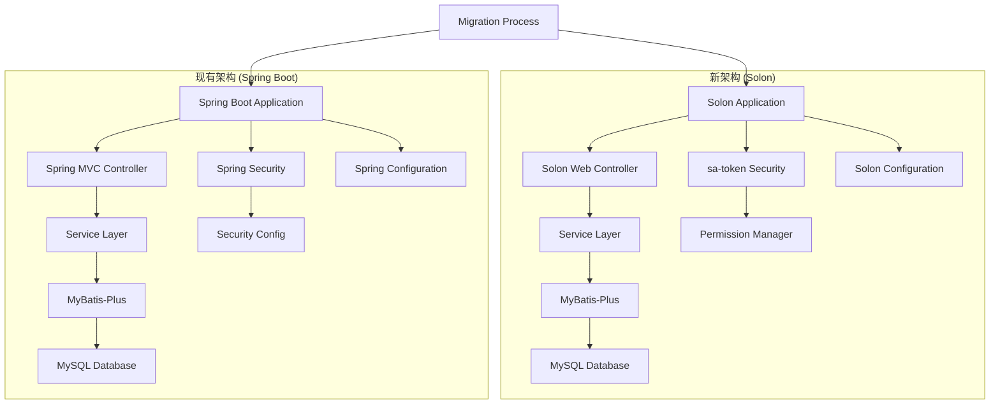
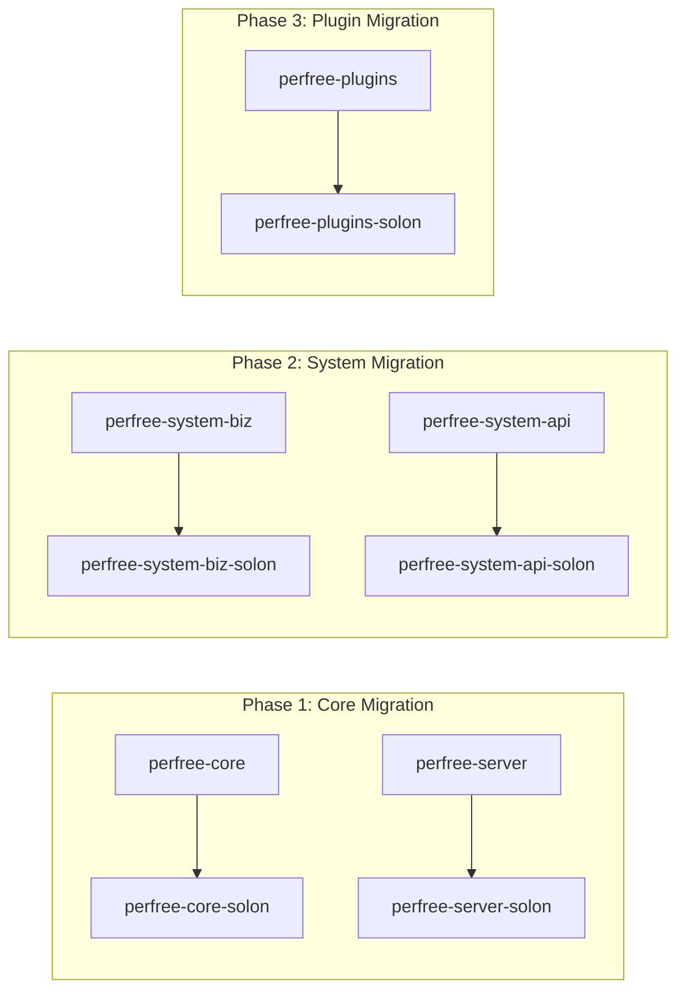

# Design Document

## Overview

本设计文档详细描述了将PerfreeBlog项目从Spring Boot框架迁移到Solon框架，并将Spring Security替换为sa-token的技术方案。迁移将采用渐进式方法，确保系统功能的连续性和稳定性。

### 迁移策略

采用**并行迁移**策略：
1. 保留现有的Spring Boot模块作为参考
2. 创建新的Solon版本模块
3. 逐步迁移功能模块
4. 最终替换启动入口

### 技术栈对比

| 组件 | Spring Boot | Solon | 说明 |
|------|-------------|-------|------|
| 核心框架 | Spring Boot 3.2.1 | Solon 3.5.1 | 轻量级IoC容器 |
| 安全框架 | Spring Security 6.2.1 | sa-token 1.44.0 | 简化权限控制 |
| Web层 | Spring MVC | Solon Web | 类似注解体系 |
| 数据访问 | MyBatis-Plus | MyBatis-Plus + Solon | 保持不变 |
| 配置管理 | @ConfigurationProperties | @Configuration | Solon配置绑定 |
| 依赖注入 | @Autowired | @Inject | JSR-330标准 |

## Architecture

### 整体架构设计



### 模块迁移架构



## Components and Interfaces

### 1. 应用启动组件

#### Spring Boot版本
```java
@SpringBootApplication
@ComponentScan(nameGenerator = FullyQualifiedAnnotationBeanNameGenerator.class)
@EnableAsync
public class Application {
    public static void main(String[] args) {
        SpringApplication.run(Application.class, args);
    }
}
```

#### Solon版本设计
```java
@SolonMain
public class SolonApplication {
    public static void main(String[] args) {
        Solon.start(SolonApplication.class, args);
    }
}
```

### 2. Web控制器组件

#### 注解映射表

| Spring Boot | Solon | 说明 |
|-------------|-------|------|
| @RestController | @Controller | 控制器声明 |
| @RequestMapping | @Mapping | 路径映射 |
| @GetMapping | @Get | GET请求 |
| @PostMapping | @Post | POST请求 |
| @PutMapping | @Put | PUT请求 |
| @DeleteMapping | @Delete | DELETE请求 |
| @RequestParam | @Param | 请求参数 |
| @PathVariable | @Path | 路径变量 |
| @RequestBody | @Body | 请求体 |

#### 控制器迁移示例
```java
// Spring Boot版本
@RestController
@RequestMapping("/api/user")
public class UserController {
    @Autowired
    private UserService userService;
    
    @GetMapping("/{id}")
    @PreAuthorize("@ss.hasPermission('admin:user:query')")
    public CommonResult<User> getUser(@PathVariable Integer id) {
        return success(userService.getById(id));
    }
}

// Solon版本
@Controller
@Mapping("/api/user")
public class UserController {
    @Inject
    private UserService userService;
    
    @Get("/{id}")
    @SaCheckPermission("admin:user:query")
    public CommonResult<User> getUser(@Path Integer id) {
        return success(userService.getById(id));
    }
}
```

### 3. 服务层组件

#### 依赖注入迁移
```java
// Spring Boot版本
@Service
public class UserServiceImpl implements UserService {
    @Autowired
    private UserMapper userMapper;
}

// Solon版本
@Component
public class UserServiceImpl implements UserService {
    @Inject
    private UserMapper userMapper;
}
```

### 4. 安全认证组件

#### sa-token配置设计
```java
@Configuration
public class SaTokenConfig {
    
    @Bean
    public StpInterface stpInterface() {
        return new StpInterfaceImpl();
    }
    
    @Bean
    public SaServletFilter saServletFilter() {
        return new SaServletFilter()
            .addInclude("/**")
            .addExclude("/api/auth/login", "/api/auth/register")
            .setAuth(obj -> {
                // 权限验证逻辑
                SaRouter.match("/api/admin/**", () -> StpUtil.checkRole("admin"));
            });
    }
}
```

#### 权限验证接口实现
```java
@Component
public class StpInterfaceImpl implements StpInterface {
    
    @Inject
    private UserService userService;
    
    @Inject
    private RoleService roleService;
    
    @Override
    public List<String> getPermissionList(Object loginId, String loginType) {
        // 获取用户权限列表
        return userService.getUserPermissions(Integer.valueOf(loginId.toString()));
    }
    
    @Override
    public List<String> getRoleList(Object loginId, String loginType) {
        // 获取用户角色列表
        return userService.getUserRoles(Integer.valueOf(loginId.toString()));
    }
}
```

### 5. 配置管理组件

#### 配置属性迁移
```java
// Spring Boot版本
@ConfigurationProperties(prefix = "perfree.mail")
@Data
public class MailProperties {
    private String host;
    private Integer port;
    private String username;
    private String password;
}

// Solon版本
@Configuration
@ConfigurationProperties(prefix = "perfree.mail")
@Data
public class MailProperties {
    private String host;
    private Integer port;
    private String username;
    private String password;
}
```

### 6. 数据访问组件

#### MyBatis-Plus配置
```java
@Configuration
public class MybatisPlusConfig {
    
    @Bean
    public MybatisPlusInterceptor mybatisPlusInterceptor() {
        MybatisPlusInterceptor interceptor = new MybatisPlusInterceptor();
        interceptor.addInnerInterceptor(new PaginationInnerInterceptor(DbType.MYSQL));
        return interceptor;
    }
    
    @Bean
    public DataSource dataSource() {
        // 数据源配置
        return DataSourceBuilder.create().build();
    }
}
```

## Data Models

### 用户认证数据模型

```java
@Data
public class LoginUser {
    private Integer userId;
    private String username;
    private String nickname;
    private String avatar;
    private List<String> roles;
    private List<String> permissions;
    private Long loginTime;
    private String loginIp;
}
```

### 权限数据模型

```java
@Data
public class PermissionInfo {
    private String permission;
    private String description;
    private String module;
    private Integer sort;
}
```

## Error Handling

### 全局异常处理

#### Spring Boot版本
```java
@ControllerAdvice
public class GlobalExceptionHandler {
    @ExceptionHandler(Exception.class)
    public ResponseEntity<CommonResult> handleException(Exception e) {
        return ResponseEntity.ok(CommonResult.error(e.getMessage()));
    }
}
```

#### Solon版本
```java
@Component
public class GlobalExceptionHandler implements HandlerExceptionResolver {
    
    @Override
    public ModelAndView resolveException(HttpServletRequest request, 
                                       HttpServletResponse response, 
                                       Object handler, Exception ex) {
        // 异常处理逻辑
        return new ModelAndView();
    }
}
```

### sa-token异常处理

```java
@Component
public class SaTokenExceptionHandler {
    
    @EventListener
    public void handleNotLoginException(NotLoginException e) {
        // 未登录异常处理
        log.warn("用户未登录: {}", e.getMessage());
    }
    
    @EventListener
    public void handleNotPermissionException(NotPermissionException e) {
        // 权限不足异常处理
        log.warn("权限不足: {}", e.getMessage());
    }
}
```

## Testing Strategy

### 测试框架迁移

#### 单元测试
```java
// Spring Boot版本
@SpringBootTest
class UserServiceTest {
    @Autowired
    private UserService userService;
    
    @Test
    void testGetUser() {
        // 测试逻辑
    }
}

// Solon版本
@SolonTest
class UserServiceTest {
    @Inject
    private UserService userService;
    
    @Test
    void testGetUser() {
        // 测试逻辑
    }
}
```

#### Web层测试
```java
// Solon版本
@SolonTest
class UserControllerTest {
    
    @Test
    void testGetUser() throws Exception {
        // 使用Solon的测试工具进行Web层测试
    }
}
```

### 集成测试策略

1. **数据库集成测试**：使用H2内存数据库进行测试
2. **API集成测试**：测试完整的请求-响应流程
3. **权限集成测试**：验证sa-token权限控制
4. **性能测试**：对比迁移前后的性能指标

## Migration Implementation Plan

### Phase 1: 基础框架迁移 (1-2周)

1. **创建Solon版本的核心模块**
   - 创建`perfree-server-solon`模块
   - 配置Solon基础依赖
   - 实现基本的应用启动

2. **迁移配置管理**
   - 迁移application.yml配置
   - 实现Solon配置绑定
   - 测试配置加载

### Phase 2: Web层迁移 (2-3周)

1. **控制器迁移**
   - 批量替换Spring MVC注解为Solon注解
   - 迁移请求处理逻辑
   - 实现全局异常处理

2. **中间件迁移**
   - 迁移拦截器逻辑
   - 实现CORS配置
   - 配置静态资源处理

### Phase 3: 安全框架迁移 (2-3周)

1. **sa-token集成**
   - 配置sa-token基础设置
   - 实现权限接口
   - 迁移登录登出逻辑

2. **权限控制迁移**
   - 替换@PreAuthorize为@SaCheckPermission
   - 实现角色权限管理
   - 测试权限控制功能

### Phase 4: 服务层迁移 (1-2周)

1. **依赖注入迁移**
   - 替换@Autowired为@Inject
   - 替换@Service为@Component
   - 验证依赖注入功能

2. **事务管理迁移**
   - 配置Solon事务管理
   - 测试事务功能
   - 验证数据一致性

### Phase 5: 数据访问层迁移 (1周)

1. **MyBatis-Plus配置**
   - 配置Solon版本的MyBatis-Plus
   - 测试数据库连接
   - 验证CRUD操作

### Phase 6: 插件系统迁移 (2-3周)

1. **插件框架适配**
   - 分析现有插件加载机制
   - 适配Solon的组件加载
   - 测试插件热插拔功能

### Phase 7: 测试和优化 (1-2周)

1. **全面测试**
   - 功能测试
   - 性能测试
   - 压力测试

2. **性能优化**
   - 内存使用优化
   - 启动时间优化
   - 响应时间优化

## Performance Considerations

### 预期性能提升

1. **内存占用**：预期减少30-50%
2. **启动时间**：预期减少50-70%
3. **响应时间**：预期提升10-20%
4. **并发处理能力**：预期提升20-30%

### 性能监控指标

1. **JVM指标**：堆内存使用、GC频率
2. **应用指标**：请求响应时间、吞吐量
3. **系统指标**：CPU使用率、内存使用率

## Risk Assessment

### 高风险项

1. **插件系统兼容性**：现有插件可能需要大量修改
2. **第三方库兼容性**：某些Spring特定的库可能不兼容
3. **复杂业务逻辑**：涉及Spring特性的复杂逻辑迁移风险

### 风险缓解策略

1. **并行开发**：保持原系统运行，新系统并行开发
2. **渐进迁移**：分模块逐步迁移，降低风险
3. **充分测试**：每个阶段都进行充分的功能和性能测试
4. **回滚方案**：准备快速回滚到原系统的方案

## Security Considerations

### sa-token安全配置

1. **Token安全**：配置Token加密和签名
2. **会话管理**：实现安全的会话管理
3. **权限控制**：细粒度的权限控制
4. **防护机制**：防止常见的安全攻击

### 数据安全

1. **敏感数据加密**：用户密码、敏感配置加密
2. **SQL注入防护**：使用参数化查询
3. **XSS防护**：输入输出过滤
4. **CSRF防护**：实现CSRF令牌机制