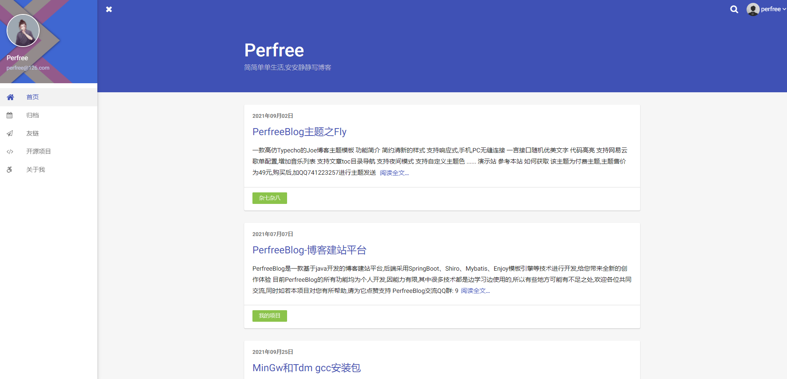
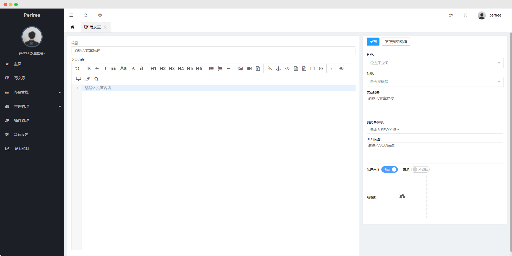
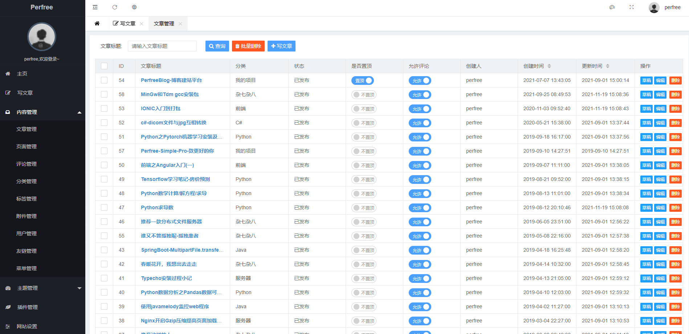
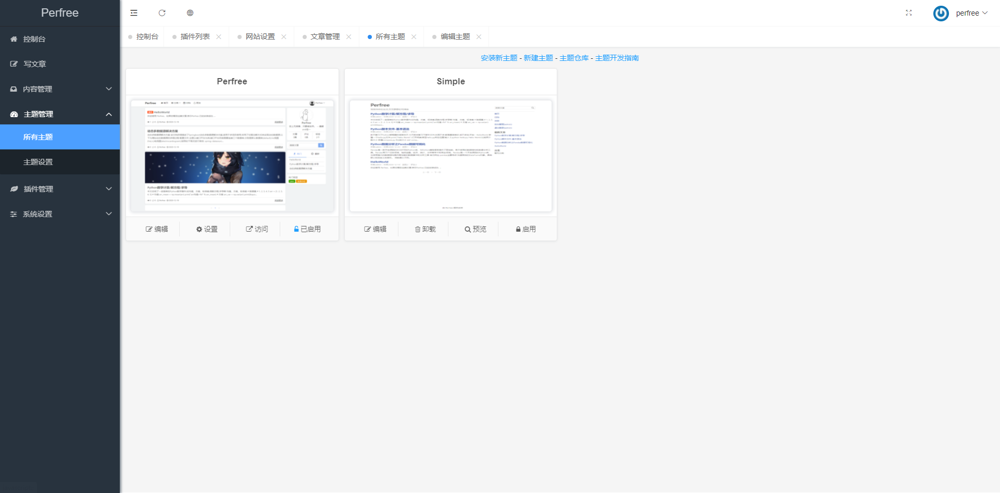
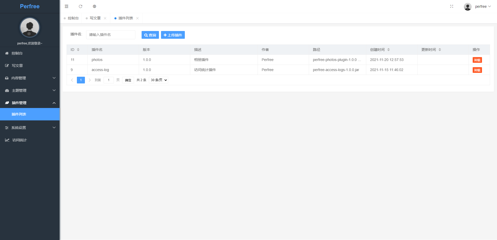

<p align="center">
    <a href="http://perfree.org.cn" target="_blank" rel="noopener noreferrer">
        
    </a>
</p>

> PerfreeBlog是一款基于java开发的博客建站平台

<p align="center">
    <a href="https://github.com/perfree/PerfreeBlog/releases">
        
    </a>
    <a href="https://github.com/perfree/PerfreeBlog/blob/master/LICENSE">
        
    </a>
    <a href="https://github.com/perfree/PerfreeBlog/commits/master">
        
    </a>
    <a href="https://registry.hub.docker.com/repository/docker/perfree/perfree">
        
    </a>
</p>

------------------------------

## 简介
PerfreeBlog是一款基于Java SpringBoot开发的博客建站平台,支持多主题及扩展插件功能,给您带来全新的创作体验

* 官网地址: [http://perfree.org.cn](http://perfree.org.cn)
* 文档地址: [http://perfree.gitee.io](http://perfree.gitee.io)
* 开发计划: [板栗看板](https://web.banlikanban.com/kanban/6193a5656f6f640fbe2d08e4)


## 功能简介
* 设计简洁，界面美观
* 采用[Markdown](https://www.markdownguide.org/)/富文本双编辑器,支持一键插入视频、图片、附件等
* 支持多主题自由切换
* 强大的主题在线编辑功能,支持多种文件操作,实时生效,支持在网页直接创建新主题,快速开发页面
* 支持自定义页面
* 支持友情链接
* 支持附件管理,附件在线预览
* 支持扩展插件,编写java代码打包为jar,直接后台安装生效,丰富程序多样性
* 主题开发简单快速,多种自定义指令及api接口支持
* 支持邮件服务,评论信息邮件提醒
* 安装部署简单
* 支持[mysql](https://www.mysql.com)/[sqlite](https://www.sqlite.org)数据库

## 快速开始
windows/linux:
```
下载最新的 PerfreeBlog 运行包解压后执行:
windows: 双击start.bat
linux: ./start.sh start
```
docker:
```
docker run --name perfree -d -p 8080:8080 perfree/perfree
```
## 交流群
> QQ交流群: 938402724
 
 微信交流群(添加微信入群,备注PerfreeBlog):
 

 
## 主题支持
### 默认主题


### fly


### indigo


## 后台界面
### 写文章


### 文章管理


### 主题


### 主题编辑


### 插件管理


## 技术栈
以下包含了所使用到的技术栈及开发环境版本

| 名称                 | 版本     |
|--------------------|--------|
| JDK                | 1.8    |
| Mysql              | 8.0.21 |
| SQLite             | 3      |
| SpringBoot         | 2.5.14 |
| Mybatis-SpringBoot | 2.2.2  |
| Enjoy              | 4.9.02 |
| shiro              | 1.9.1  |

## 源码运行
如需使用源码运行或二次开发,可参考以下步骤:
```
注意: jdk版本为1.8
1. 下载源码并在idea打开
2. 执行maven clean
3. 执行maven install
4. 运行perfree-web下的Application.java即可(不需要配置数据库,不需要配置数据库)
5. 访问8080端口进行安装
```
打包注意事项:
```
打包前需将perfree-web模块pom.xml中注释的部分放开
<excludes>
    <exclude>static/**</exclude>
    <exclude>Perfree.sql</exclude>
    <exclude>Perfree-sqlite.sql</exclude>
    <exclude>update.sql</exclude>
    <exclude>update-sqlite.sql</exclude>
</excludes>
<filtering>true</filtering>

之后执行maven clean, maven packge即可,打包后会生成zip,tar.gz压缩包请选择任意一个使用,不要单独使用jar包
```
