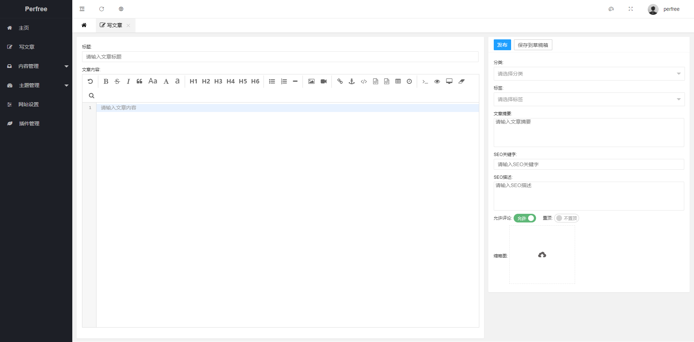
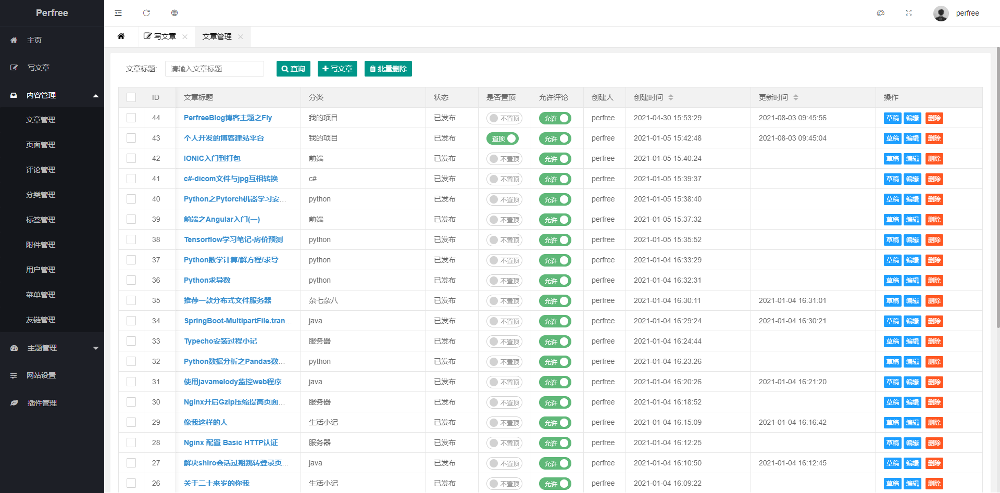
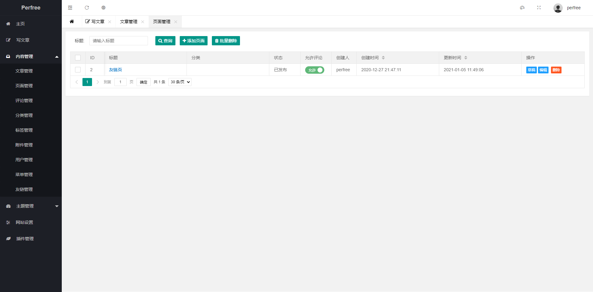
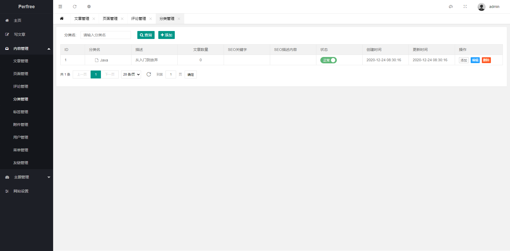
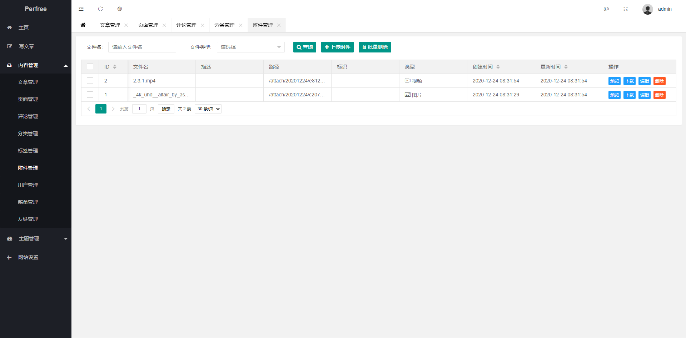
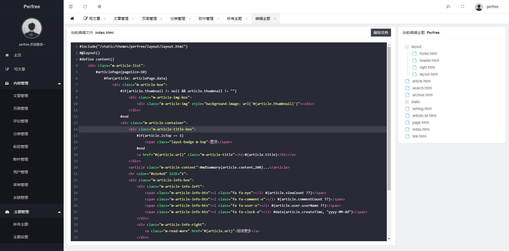

## 简介
Perfree是一款基于java开发的博客建站平台,后端采用[SpringBoot](https://spring.io/projects/spring-boot)、[Shiro](https://shiro.apache.org)、[Mybatis](https://mybatis.org/)、[Enjoy](https://jfinal.com/doc/6-1)模板引擎等技术进行开发,给您带来全新的创作体验
> 目前Perfree的所有功能均为个人开发,因能力有限,其中很多技术都是边学习边使用的,所以有些地方可能有不足之处,欢迎各位共同交流,同时如若本项目对您有所帮助,请为它[点赞](https://github.com/perfree/PerfreeProject)支持 

* 官网地址: [http://www.perfree.org.cn](http://www.perfree.org.cn)
* 文档地址: [http://www.perfree.org.cn/doc](http://www.perfree.org.cn/doc)
* ~~社区论坛: [http://bbs.perfree.org](http://bbs.perfree.org) 暂时停止使用~~
* 演示站点: [https://www.yinpengfei.com](https://www.yinpengfei.com)

## 特性
* 设计简洁，界面美观
* 采用[Markdown](https://www.markdownguide.org/)编辑器,支持一键插入视频、图片
* 支持多主题自由切换
* 主题在线编辑,及时生效
* 友情链接管理
* 支持附件管理
* 支持扩展插件
* 主题开发简单快速
* 支持邮件服务
* 安装部署简单
* 支持[mysql](https://www.mysql.com)/[sqlite](https://www.sqlite.org)数据库

## 界面预览
### 写文章


### 文章管理


### 页面管理


### 分类管理


### 附件管理


### 主题


### 主题编辑


## 技术栈
以下包含了所使用到的技术栈及开发环境版本

|  名称   | 版本  |
|  ----  | ----  |
| JDK  | 1.8 |
| Mysql  | 8.0.21 |
| SQLite  | 3 |
| SpringBoot  | 2.3.0.RELEASE |
| Mybatis-SpringBoot  | 1.3.0 |
| Enjoy  | 4.9.02 |
| undertow  | 2.3.0.RELEASE |
| shiro  | 1.4.0 |

## 源码运行
如需使用源码运行或二次开发,可参考以下步骤:
```
1. 下载源码并在idea打开
2. 执行maven clean
3. 执行maven install
4. 运行perfree-web下的Application.java即可
```

## 后期开发计划
* 整体界面美化
* ~~api接口开发(已完成)~~
* 优化插件开发方式
* 新增一款免费博客主题
* 新增一款免费相册插件
