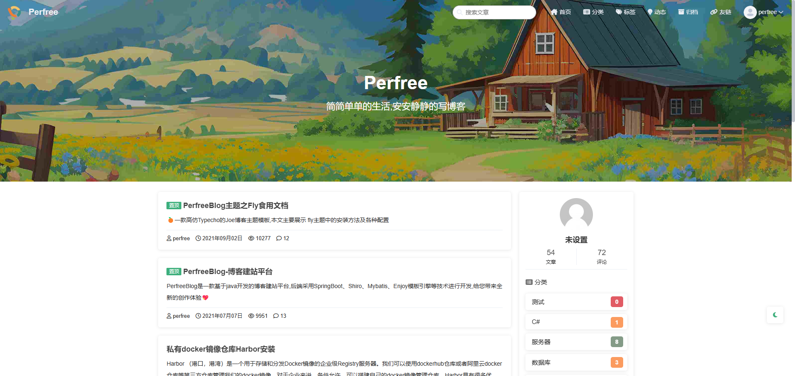
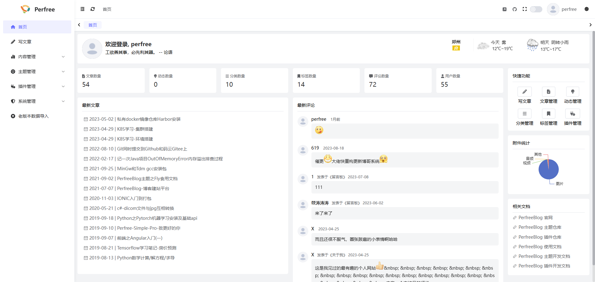
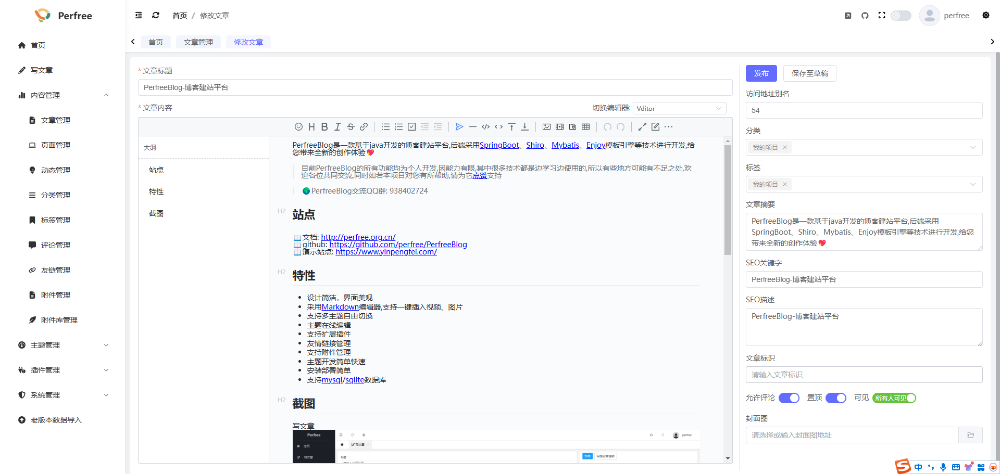
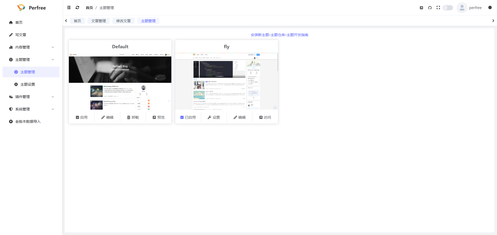
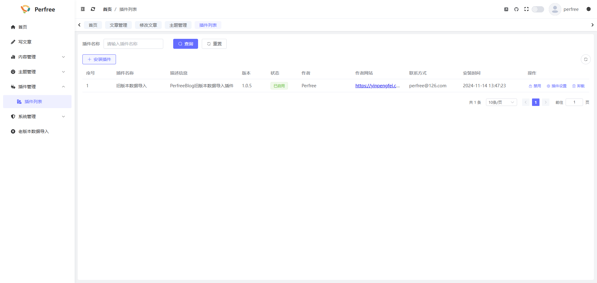

## 简介
PerfreeBlog是一款基于java开发的博客/CMS建站平台,丰富的主题支持及扩展插件功能,给您带来全新的创作体验~


* 官网地址: [https://perfree.org.cn](https://perfree.org.cn)
* 老版文档地址: [https://docs.perfree.org.cn](https://docs.perfree.org.cn)
* 新版文档地址: 编写中...

## 功能简介
* 设计简洁，界面美观
* 支持多主题自由切换
* 强大的主题在线编辑功能, 支持主题在线编辑
* 支持自定义页面
* 支持友情链接
* 支持附件管理,附件在线预览
* 支持扩展插件,插件编写方式与普通程序基本一致,直接后台安装生效,丰富程序多样性
* 主题开发简单快速,多种自定义指令及api接口支持
* 支持邮件服务,评论信息邮件提醒
* 安装部署简单
* ......

## 快速开始
项目支持Mysql数据库, 请先创建数据库,编码格式最好为utf8mb4,无需执行初始化脚本, 之后按照平台参考以下步骤操作即可

#### windows/linux
1. 安装jdk17(安装过程略)
2. 下载最新的 PerfreeBlog 运行包解压,
3. 修改config目录下application-prod.yaml配置文件中的端口和数据库信息
4. 之后参照以下命令运行
```
windows: 双击start.bat
linux: ./start.sh start
```

#### docker
注意将命令中数据库账户/数据库ip地址/数据库端口/创建的数据库名称/数据库密码/文件映射目录/版本号进行替换
```
sudo docker run -d -p 8080:8080 --name PerfreeBlog --privileged=true \
-e "SPRING_DATASOURCE_USERNAME=数据库账户" \
-e "SPRING_DATASOURCE_URL=jdbc:mysql://数据库ip地址:数据库端口/创建的数据库名称?useSSL=false&allowPublicKeyRetrieval=true&useUnicode=true&characterEncoding=UTF-8&nullCatalogMeansCurrent=true" \
-e "SPRING_DATASOURCE_PASSWORD=数据库密码" \
-v  文件映射目录:/perfree-server/resources \
registry.cn-hangzhou.aliyuncs.com/perfree/perfree_blog:版本号
```

#### docker compose
下载 [https://raw.githubusercontent.com/PerfreeBlog/PerfreeBlog/refs/heads/develop-4.0.0/docker-compose.yml](https://raw.githubusercontent.com/PerfreeBlog/PerfreeBlog/refs/heads/develop-4.0.0/docker-compose.yml)
```
docker compose up -d
```
## 老版本数据导入
PerfreeBlog安装完毕后, 安装[https://github.com/PerfreeBlog/perfree-plugin-old-import/releases](https://github.com/PerfreeBlog/perfree-plugin-old-import/releases)老版本数据导入插件,在插件界面中操作即可

## 技术栈
以下包含了所使用到的技术栈及开发环境版本

| 名称           | 版本     |
|--------------|--------|
| JDK          | \>=17  |
| mysql        | 8.0.21 |
| mybatis-plus | 3.5.6  |
| SpringBoot   | 3.2.1  |
| security     | 6.2.1  |
| vue          | 3.4.29 |
| element plus | 2.7.7  |

## 预览图











